  

 

<!-- ═══════════════ ABOUT ═══════════════ -->
<h2>👋 About me</h2>

I'm an Informatics Engineering student based in Depok, Indonesia. 
I focus on building functional web applications, database management, and exploring data analysis. 
Passionate about clean code, practical problem-solving, and capturing moments through photography & outdoor treks.

<table>
  <tr>
    <td align="center" width="230"><h3>🔭</h3><b>Building</b> Web Applications &amp; Side Projects</td>
    <td align="center" width="230"><h3>🌱</h3><b>Learning</b> Data Analysis &amp; Machine Learning</td>
    <td align="center" width="230"><h3>🔧</h3><b>Strong at</b> Web Dev, MySQL &amp; UI Design</td>
  </tr>
  <tr>
    <td align="center" width="230"><h3>⛰️</h3><b>After hours</b> Mountain Hiking &amp; Photography 📷</td>
    <td align="center" width="230"><h3>☕</h3><b>Fuel</b> Coffee &amp; Curiosity</td>
    <td align="center" width="230"><h3>📍</h3><b>Based in</b> Depok, West Java, Indonesia 🇮🇩</td>
  </tr>
</table>

 

<i>"Keep it simple, make it work, then improve it."</i>

  

<!-- ═══════════════ GOALS ═══════════════ -->
<h2>🎯 Current goals</h2>

| | Goal | Status |
|:-:|:--|:-:|
| 🚀 | Build & deploy functional web & database systems |  |
| 📊 | Level up in Data Analysis & Machine Learning workflows |  |
| 💼 | Land an internship in Web Development or Data Analysis |  |
| 🌐 | Contribute to open-source software projects |  |

 

<!-- ═══════════════ TECH STACK ═══════════════ -->
<h2>🛠️ Tech stack</h2>

<table>
  <tr>
    <td align="right"><b>Languages</b></td>
    <td></td>
  </tr>
  <tr>
    <td align="right"><b>Databases & Tools</b></td>
    <td></td>
  </tr>
  <tr>
    <td align="right"><b>Data & Analysis</b></td>
    <td></td>
  </tr>
</table>

 

<!-- ═══════════════ STATS ═══════════════ -->
<h2>📊 GitHub stats</h2>

  

  

 

<h2>🐍 Contributions</h2>

  

<!-- ═══════════════ CONTACT ═══════════════ -->
<h2>📫 Let's connect</h2>

I'm open to collaboration, internships, or tech discussions.  
📧 <a href="mailto:ahmadragiel10@gmail.com">ahmadragiel10@gmail.com</a> 
📷 <a href="https://instagram.com/ragielzaini">@ragielzaini</a>

 

  

